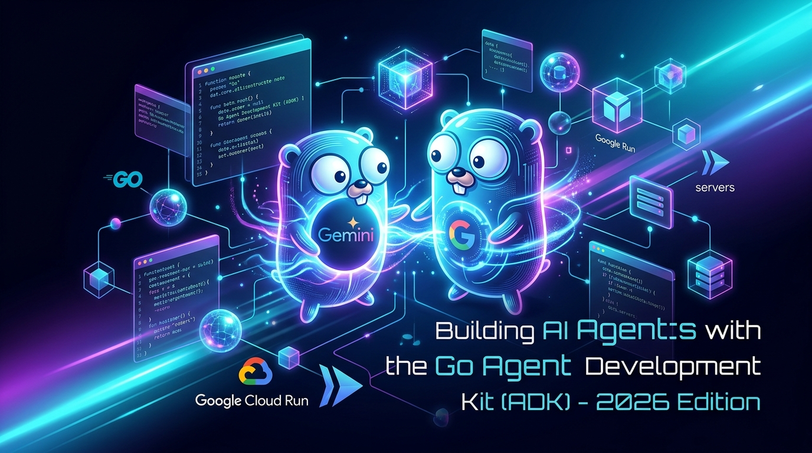

# Building AI Agents with the GO Agent Development Kit (ADK) — 2026 Edition (v2)



**Published:** 2026-07-26  
**Go ADK Version:** `google.golang.org/adk/v2 v2.1.0`  
**Google GenAI SDK Version:** `google.golang.org/genai v1.65.0`  
**Go Version:** Go `1.26.3` / `1.26.5` module directives  

---

## Summary of 2026 Updates (v2 — Go ADK 2.0 Migration)

This updated edition incorporates several key architectural improvements, production hardening, and dependency upgrades over the initial release:

- **Go ADK 2.0 Core Upgrade**: Upgraded to **`v2.1.0`** (`google.golang.org/adk/v2`, GA released June 30, 2026 at [adk.dev/2.0/](https://adk.dev/2.0/)), introducing `agent.Context` for unified tool context management and callback execution pipelines.
- **Google GenAI SDK Upgrade**: Upgraded to **`v1.65.0`** (`google.golang.org/genai`) with native Vertex AI authentication auto-detection.
- **Go Toolchain & Module Directives**: Updated runtime environment to **Go `1.26.3`** with `go 1.26.5` module directives across all sub-modules.
- **A2A (Agent-to-Agent) Multi-Agent System**: Integrated `github.com/a2aproject/a2a-go` (`v0.3.15`) with sub-modules (`a2a-client-go`, `a2a-server-go`, `a2a-master-go`, `a2a-gemini3-go`) for multi-agent delegation.
- **Structured Logging (`slog`) Standardization**: Standardized logging on `slog` with `JSONHandler` across all entrypoints for native Google Cloud Logging compatibility.
- **Graceful OS Signal Contexts**: Integrated `signal.NotifyContext(context.Background(), os.Interrupt)` across all sub-module entrypoints to handle container termination cleanly.
- **Robust Tool Input Validation**: Added input bounds checking for `rollDieTool` (`sides <= 0`) to prevent runtime panics from malformed LLM tool calls.
- **Safe Dockerfile `CMD` Generation**: Fixed `cloudrun.go` to construct container arguments with `json.Marshal`, ensuring valid `CMD` syntax regardless of feature flags.
- **Unified Multi-Module Makefile**: Updated root `Makefile` to format (`go fmt`), lint (`go vet`), test (`go test`), build, and clean across all 5 submodules (`hello-agent`, `a2a-client-go`, `a2a-gemini3-go`, `a2a-master-go`, `a2a-server-go`).
- **Verified Build & Test Suite**: All unit tests (`go test -v ./...`), formatting (`go fmt`), linting (`go vet ./...`), and `make build` pass with 0 errors.

---

## Native Go Agent Development with the Go ADK

This tutorial provides a comprehensive guide to building, running, and deploying native AI Agents using the Go programming language and the official **Go Agent Development Kit (ADK)** (`google.golang.org/adk`).

### What Is Go?

Go (Golang) is an open-source programming language created at Google. Renowned for its simplicity, concurrency support via goroutines, and fast execution speed, Go is an exceptional choice for building high-throughput microservices and distributed agent systems.

- Official Go Project: [go.dev](https://go.dev)
- Google Open Source: [opensource.google/projects/go](https://opensource.google/projects/go)

---

### Prerequisites & Go Version Upgrades

This project has been updated to run on **Go 1.26** (specifically **`go1.26.3 linux/amd64`**) with `go 1.25.0` module directives across all sub-modules.

#### 1. Installing or Upgrading Go with GVM (Go Version Manager)

If you are using **gvm** to manage Go installations:

```bash
# Dependencies for Linux / Debian / Ubuntu
sudo apt-get update
sudo apt-get install -y bison curl git mercurial make binutils gcc build-essential

# Install GVM (if not already installed)
bash < <(curl -s -S -L https://raw.githubusercontent.com/moovweb/gvm/master/binscripts/gvm-installer)

# Install and switch to Go 1.26.3
gvm install go1.26.3 -B
gvm use --default go1.26.3
```

#### 2. Validating Installed Go Version

Verify that your active Go binary is **Go 1.26.3**:

```bash
$ go version
go version go1.26.3 linux/amd64
```

#### 3. Module Version Directives (`go 1.26.5`)

All `go.mod` files in this workspace use `go 1.26.5` directives to support modern language features and telemetry packages required by Go ADK 2.0 (`google.golang.org/adk/v2` `v2.1.0`).

---

### What is the Go Agent Development Kit (ADK 2.0)?

The **Go Agent Development Kit (ADK 2.0)** (`google.golang.org/adk/v2`) is a code-first toolkit developed by Google for building, evaluating, and deploying sophisticated AI agents.

#### Key Features:
- **Model-Agnostic & Deployment-Agnostic**: Optimized for Gemini models on Google Cloud Vertex AI or Google AI Studio, but designed for cross-framework compatibility.
- **Unified Context & Tool Handling**: Uses `agent.Context` to pass unified invocation state, session management, and Human-in-the-Loop (HITL) tools.
- **A2A (Agent-to-Agent) Protocol Support**: Native integration with `github.com/a2aproject/a2a-go` (v0.3.15+) for multi-agent collaboration.
- **Built-in CLI & Web UI Tools**: Local interactive debugging out of the box.

Official Repositories & Docs:
- Documentation & GA Portal: [https://adk.dev/2.0/](https://adk.dev/2.0/)
- Go ADK 1.x Compatibility & Migration Guide: [https://adk.dev/2.0/#adk-go-1x-compatibility](https://adk.dev/2.0/#adk-go-1x-compatibility)
- Go ADK GitHub Repository: [https://github.com/google/adk-go](https://github.com/google/adk-go)
- Google Gen AI Go SDK: [github.com/googleapis/go-genai](https://github.com/googleapis/go-genai)

---

### Key Dependencies (`go.mod`)

The updated agent stack relies on the latest releases:

```gomod
module hello-agent

go 1.26.5

require (
	google.golang.org/adk/v2 v2.1.0
	google.golang.org/genai v1.65.0
	github.com/a2aproject/a2a-go/v2 v2.3.1
)
```

---

### Checking the Developer Environment

Clone the repository and set up environment credentials:

```bash
git clone https://github.com/xbill9/adk-hello-world-go
cd adk-hello-world-go
```

#### 1. Authentication & Environment Setup

Run `init.sh` to initialize settings:

```bash
$ source init.sh
--- Authentication Method ---
Do you want to use a Gemini API Key for authentication? (y/n): n
--- Setup complete ---
```

Then load project-wide environment variables using `set_env.sh`:

```bash
$ source set_env.sh
--- Setting Google Cloud Environment Variables ---
Checking gcloud authentication status...
gcloud is authenticated.
Exported PROJECT_ID=comglitn
Exported PROJECT_NUMBER=1056842563084
Exported GOOGLE_CLOUD_PROJECT=comglitn
Exported GOOGLE_GENAI_USE_VERTEXAI=TRUE
Exported GOOGLE_CLOUD_LOCATION=us-central1
--- Environment setup complete ---
```

If Google Cloud authentication expires, refresh credentials:

```bash
gcloud auth login
gcloud auth application-default login
```

---

### Building, Formatting, and Testing All Agent Submodules

The project includes unified Makefile targets for linting, formatting, compiling, and testing all 5 agent submodules (`hello-agent`, `a2a-client-go`, `a2a-gemini3-go`, `a2a-master-go`, `a2a-server-go`):

```bash
# Format code across all submodules
make format

# Lint code with go vet across all submodules
make lint

# Run unit tests across all submodules
make test

# Build executables across all submodules
make build

# Clean build artifacts
make clean
```

---

### Production Hardening & Best Practices

#### 1. Structured Logging with `slog`

All entrypoints use `slog` configured with `JSONHandler` to emit logs compatible with Google Cloud Logging:

```go
logger := slog.New(slog.NewJSONHandler(os.Stdout, nil))
slog.SetDefault(logger)
```

#### 2. Graceful Shutdown Signals

Service entrypoints use `signal.NotifyContext` to handle `SIGINT` and `SIGTERM` signals gracefully during Cloud Run container lifecycle events:

```go
ctx, cancel := signal.NotifyContext(context.Background(), os.Interrupt)
defer cancel()
```

#### 3. Defensive Tool Parameter Validation

Custom agent tools validate input bounds to prevent runtime panics when executing tool calls generated by LLMs:

```go
func rollDieTool(ctx agent.Context, args rollDieToolArgs) (int, error) {
    if args.Sides <= 0 {
        return 0, fmt.Errorf("number of sides must be greater than 0, got %d", args.Sides)
    }
    return rand.Intn(args.Sides) + 1, nil
}
```

---

### Running the ADK Agent Locally

#### Option A: Terminal CLI Interface

Run the agent interactively in your terminal using `cli.sh`:

```bash
$ source cli.sh
go run agent.go

User -> what can you do?

Agent -> I can help you with a variety of tasks! I can answer questions, search information on Google, and tell you current time or weather in any city.

User -> what is the weather in NYC?

Agent -> The current weather in New York City is sunny with a temperature of 65°F (18°C)...
```

#### Option B: Local Web UI

Launch the embedded Web UI with `web.sh`:

```bash
$ source web.sh
```

Navigate to `http://localhost:8081` in your browser to interact with the visual chat interface.

---

### Agent-to-Agent (A2A) Multi-Agent Architecture

The 2026 update introduces full Agent-to-Agent communication modules:

- `hello-agent`: Core single-agent implementation.
- `a2a-server-go`: Exposes agent capabilities over A2A HTTP endpoints.
- `a2a-client-go`: Client library for dispatching requests to remote A2A agents.
- `a2a-master-go` & `a2a-gemini3-go`: Orchestrators for complex multi-agent workflows using Gemini models.

---

### Cloud Run Deployment Strategies

#### Strategy 1: Quick Deployment via Docker & Cloud Build (`quickrun.sh`)

Deploy to Google Cloud Run using the automated build script:

```bash
$ source quickrun.sh
Building using Dockerfile and deploying container to Cloud Run service [adk-hello-world-go]...
✓ Building Container...
✓ Creating Revision...
✓ Routing traffic...
Service URL: https://adk-hello-world-go-1056842563084.us-central1.run.app
```

#### Strategy 2: Official `adkgo` CLI Deployment

Build the `adkgo` CLI tool from the `adk-go` upstream repository:

```bash
cd ~
git clone https://github.com/google/adk-go
cd adk-go
go build ./cmd/adkgo

# Deploy using adkgo
./adkgo deploy cloudrun \
    -p $GOOGLE_CLOUD_PROJECT \
    -r $GOOGLE_CLOUD_LOCATION \
    -s adk-hello-world-go \
    -e ./hello-agent/agent.go
```

#### Strategy 3: Local Proxy Access to Cloud Run (`proxy.sh`)

Connect to your deployed Cloud Run service locally:

```bash
$ source proxy.sh
PROXY URL http://127.0.0.1:8081/ui/?app=hello_time_agent
Proxying to Cloud Run service [adk-hello-world-go] in region [us-central1]
```

---

### Summary & Next Steps

In this updated version:
1. All submodules were migrated to **Go ADK 2.0 (`google.golang.org/adk/v2` v2.1.0)** and **Google GenAI `v1.65.0`** running on **Go 1.26**.
2. Custom function tools were updated to accept **`agent.Context`** for unified session state, execution flow, and tool confirmation.
3. Full support for **A2A multi-agent workflows** was integrated.
4. Production hardening for **structured logging**, **signal handling**, **input validation**, and **JSON-marshaled Dockerfile generation** was applied.
5. Local CLI, Web UI, and Cloud Run serverless deployment channels were verified and tested cleanly across all submodules.
